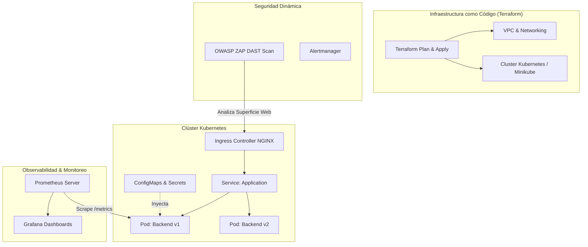

# ☸️ UAO - Infraestructura Cloud, Kubernetes y Pipeline DevOps con Seguridad OWASP

[](https://www.uao.edu.co/)
[](https://github.com/EduardCY/UAO-DevOps-Kubernetes-Terraform-Pipeline)
[](https://kubernetes.io/)
[](https://www.terraform.io/)
[](https://grafana.com/)
[](https://owasp.org/)
[](LICENSE)
[](https://github.com/EduardCY)

> **Plataforma Integral de Infraestructura como Código (IaC), Orquestación de Contenedores y DevSecOps** que incluye despliegues automatizados en Kubernetes (k8s), aprovisionamiento con Terraform, observabilidad completa (Prometheus + Grafana) y escaneo dinámico de vulnerabilidades (DAST con OWASP ZAP).

---

## 🏛️ Arquitectura de DevSecOps & Infraestructura



---

## 🔒 Capas de DevSecOps Implementadas

1. **Escaneo Estático y Dinámico (SAST/DAST):** Integración de análisis con OWASP ZAP contra endpoints públicos.
2. **Infraestructura Declarativa:** Módulos de Terraform para replicabilidad ambiental idéntica (*Dev, Staging, Prod*).
3. **Observabilidad en Tiempo Real:** Métricas de latencia p95/p99, tasa de error HTTP y consumo de CPU/Memoria en Grafana.

---

## 🚀 Guía de Inicio Rápido

Consulta [`QUICK_START.md`](QUICK_START.md) y [`SETUP_MANUAL.md`](SETUP_MANUAL.md) para detalles completos de configuración paso a paso.

```bash
git clone https://github.com/EduardCY/UAO-DevOps-Kubernetes-Terraform-Pipeline.git
cd UAO-DevOps-Kubernetes-Terraform-Pipeline

# Levantar entorno local con Docker Compose
docker compose up -d
```

---

## 👨‍💻 Autor

* **Autor:** Eduard Criollo Yule ([@EduardCY](https://github.com/EduardCY))
* **Licencia:** [MIT](LICENSE).
